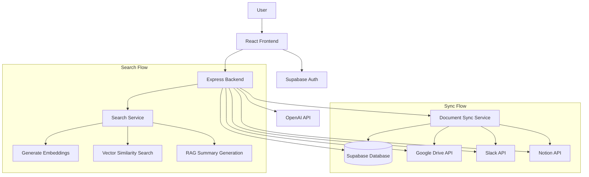

# High-Level Design (HLD) - Source Searcher Pro

## System Overview

Source Searcher Pro is an AI-powered knowledge search platform that enables users to search across multiple data sources (Google Drive, Slack, Notion) using semantic search capabilities powered by OpenAI's GPT models.

## Architecture Components

### 1. Frontend Layer
- **Technology**: React 18 + TypeScript + Vite
- **UI Framework**: Tailwind CSS + Radix UI components
- **State Management**: React Context (AuthContext)
- **Deployment**: Vercel
- **Key Features**:
  - Responsive search interface
  - OAuth integration flows
  - Real-time search results
  - Document preview and navigation

### 2. Backend Layer
- **Technology**: Node.js + Express.js
- **Deployment**: Render
- **Key Services**:
  - Authentication & Authorization
  - OAuth token management
  - Document synchronization
  - AI-powered search
  - API endpoints for all operations

### 3. Database Layer
- **Primary Database**: Supabase (PostgreSQL)
- **Features**:
  - Row Level Security (RLS)
  - Vector embeddings storage
  - User management
  - Document metadata storage
  - Search history tracking

### 4. AI/ML Layer
- **Embedding Model**: OpenAI text-embedding-3-small
- **LLM Model**: GPT-4o-mini
- **Features**:
  - Semantic search
  - Query classification
  - RAG (Retrieval Augmented Generation)
  - Document similarity detection

### 5. External Integrations
- **Google Drive API**: Document access and sync
- **Slack API**: Message and file retrieval
- **Notion API**: Page and database access
- **OpenAI API**: Embeddings and text generation

## Data Flow Architecture

## Core System Components

### 1. Authentication System
- **Provider**: Supabase Auth
- **Features**:
  - Email/password authentication
  - OAuth integration for external services
  - JWT token management
  - Row-level security policies

### 2. Document Synchronization
- **Multi-source sync**: Google Drive, Slack, Notion
- **Real-time processing**: OAuth token validation
- **Content extraction**: Text extraction from various file types
- **Chunking strategy**: Document segmentation for optimal search

### 3. Search Engine
- **Vector search**: Semantic similarity using embeddings
- **Query classification**: Intelligent query type detection
- **RAG implementation**: Context-aware answer generation
- **Result ranking**: Relevance scoring with recency boost

### 4. Data Storage
- **User data**: Profiles, connections, search history
- **Document metadata**: Titles, sources, timestamps
- **Vector embeddings**: Searchable content representations
- **Chunk storage**: Segmented document content

## Security Architecture

### 1. Authentication & Authorization
- JWT-based authentication
- OAuth 2.0 for external services
- Row-level security in database
- Token encryption for sensitive data

### 2. Data Protection
- Encrypted token storage
- Secure API communication
- User data isolation
- Audit logging for sensitive operations

## Scalability Considerations

### 1. Horizontal Scaling
- Stateless backend services
- Database connection pooling
- CDN for static assets
- Microservices architecture potential

### 2. Performance Optimization
- Vector search indexing
- Caching strategies
- Async processing
- Rate limiting

## Integration Points

### 1. External APIs
- **Google Drive**: File access and metadata
- **Slack**: Channel messages and files
- **Notion**: Pages and databases
- **OpenAI**: Embeddings and text generation

### 2. Data Synchronization
- **Incremental sync**: Only new/updated content
- **Conflict resolution**: Version management
- **Error handling**: Retry mechanisms
- **Rate limiting**: API quota management

## Deployment Architecture

### 1. Frontend Deployment
- **Platform**: Vercel
- **Features**: Automatic deployments, CDN, SSL
- **Environment**: Production, staging, development

### 2. Backend Deployment
- **Platform**: Render
- **Features**: Auto-scaling, health checks, logging
- **Database**: Supabase managed PostgreSQL

### 3. Environment Management
- **Development**: Local development with hot reload
- **Staging**: Production-like environment for testing
- **Production**: Live system with monitoring

## Monitoring & Observability

### 1. Application Monitoring
- Health check endpoints
- Error tracking and logging
- Performance metrics
- User activity tracking

### 2. Database Monitoring
- Query performance
- Connection pooling
- Storage utilization
- Backup and recovery

## Future Enhancements

### 1. Advanced Features
- Real-time collaboration
- Advanced analytics
- Custom integrations
- Mobile applications

### 2. Scalability Improvements
- Microservices architecture
- Event-driven processing
- Advanced caching
- Global CDN deployment
