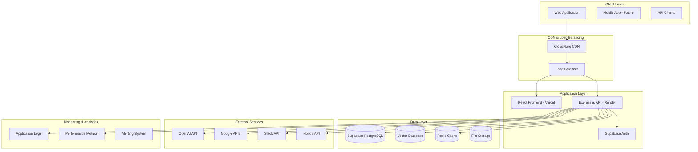
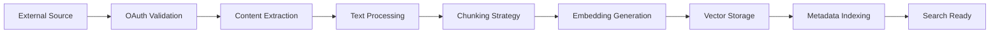
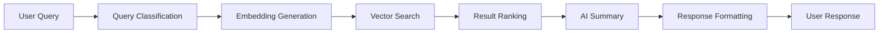

# System Design - Source Searcher Pro

## Executive Summary

Source Searcher Pro is a scalable, AI-powered knowledge search platform designed to handle enterprise-level document search across multiple data sources. This document outlines the comprehensive system design including scalability, security, performance, and deployment considerations.

## System Architecture Overview

### 1. Distributed Architecture



## Scalability Design

### 1. Horizontal Scaling Strategy

#### 1.1 Microservices Architecture (Future)
```
Current Monolith → Future Microservices
├── Auth Service (User management)
├── Search Service (AI search operations)
├── Sync Service (Document synchronization)
├── API Gateway (Request routing)
└── Notification Service (Real-time updates)
```

#### 1.2 Database Scaling
```sql
-- Read Replicas for Search Operations
Primary DB (Writes) → Read Replica 1 (Search queries)
                   → Read Replica 2 (Analytics)
                   → Read Replica 3 (Backup)

-- Sharding Strategy (Future)
Shard 1: Users A-M
Shard 2: Users N-Z
Shard 3: Enterprise customers
```

#### 1.3 Caching Layers
```javascript
// Multi-level caching strategy
L1: Application Memory Cache (Node.js)
L2: Redis Cache (Frequent queries)
L3: CDN Cache (Static assets)
L4: Database Query Cache (PostgreSQL)
```

### 2. Performance Optimization

#### 2.1 Search Performance
```javascript
// Vector search optimization
const SEARCH_OPTIMIZATION = {
  embeddingCache: 'Redis', // Cache embeddings
  vectorIndex: 'IVFFlat', // PostgreSQL vector index
  batchProcessing: true,  // Batch embedding generation
  parallelSearch: true,   // Parallel vector searches
  resultCaching: '5min'   // Cache search results
};

// Query optimization
const QUERY_OPTIMIZATION = {
  maxResults: 50,          // Limit result set
  timeout: 5000,          // 5-second timeout
  fallbackSearch: true,   // Text search fallback
  pagination: true        // Paginated results
};
```

#### 2.2 Database Performance
```sql
-- Optimized indexes for search
CREATE INDEX CONCURRENTLY idx_document_chunks_embedding 
ON document_chunks USING ivfflat (embedding vector_cosine_ops) 
WITH (lists = 100);

-- Partial indexes for active data
CREATE INDEX CONCURRENTLY idx_active_documents 
ON documents (user_id, synced_at) 
WHERE is_active = true;

-- Composite indexes for common queries
CREATE INDEX CONCURRENTLY idx_user_source_type 
ON documents (user_id, source_type, synced_at);
```

### 3. Load Balancing & Traffic Management

#### 3.1 Load Balancer Configuration
```yaml
# Nginx configuration
upstream backend {
    least_conn;
    server backend1.render.com:443 weight=3;
    server backend2.render.com:443 weight=3;
    server backend3.render.com:443 weight=2;
}

# Rate limiting
limit_req_zone $binary_remote_addr zone=api:10m rate=10r/s;
limit_req_zone $binary_remote_addr zone=search:10m rate=5r/s;
```

#### 3.2 API Rate Limiting
```javascript
// Tiered rate limiting
const RATE_LIMITS = {
  free: { requests: 100, window: '1h' },
  pro: { requests: 1000, window: '1h' },
  enterprise: { requests: 10000, window: '1h' }
};

// Endpoint-specific limits
const ENDPOINT_LIMITS = {
  '/api/search': { requests: 10, window: '1m' },
  '/api/sync': { requests: 5, window: '1h' },
  '/api/auth': { requests: 20, window: '1m' }
};
```

## Security Architecture

### 1. Multi-Layer Security

#### 1.1 Network Security
```
Internet → CloudFlare WAF → Load Balancer → Application
         ↓
    DDoS Protection
    Bot Detection
    Rate Limiting
    SSL/TLS Termination
```

#### 1.2 Application Security
```javascript
// Security middleware stack
app.use(helmet());                    // Security headers
app.use(cors(securityConfig));       // CORS policy
app.use(rateLimit(rateLimitConfig)); // Rate limiting
app.use(validateJWT);               // JWT validation
app.use(sanitizeInput);             // Input sanitization
app.use(auditLogging);              // Security logging
```

#### 1.3 Data Security
```sql
-- Encryption at rest
ALTER TABLE user_connections 
ALTER COLUMN access_token SET STORAGE EXTENDED;

-- Row Level Security
CREATE POLICY "Users can only access own data" 
ON documents FOR ALL USING (auth.uid() = user_id);

-- Audit logging
CREATE TABLE security_audit (
  id UUID PRIMARY KEY,
  user_id UUID,
  action TEXT,
  resource TEXT,
  ip_address INET,
  timestamp TIMESTAMPTZ DEFAULT NOW()
);
```

### 2. Authentication & Authorization

#### 2.1 OAuth 2.0 Implementation
```javascript
// Secure OAuth flow
const OAUTH_CONFIG = {
  google: {
    clientId: process.env.GOOGLE_CLIENT_ID,
    clientSecret: process.env.GOOGLE_CLIENT_SECRET,
    scope: 'https://www.googleapis.com/auth/drive.readonly',
    stateValidation: true,
    pkce: true
  },
  slack: {
    clientId: process.env.SLACK_CLIENT_ID,
    clientSecret: process.env.SLACK_CLIENT_SECRET,
    scope: 'channels:read,channels:history,files:read',
    stateValidation: true
  }
};

// Token encryption
const encryptToken = (token) => {
  const cipher = crypto.createCipher('aes-256-gcm', process.env.ENCRYPTION_KEY);
  return cipher.update(token, 'utf8', 'hex') + cipher.final('hex');
};
```

#### 2.2 JWT Security
```javascript
// JWT configuration
const JWT_CONFIG = {
  algorithm: 'RS256',
  expiresIn: '1h',
  issuer: 'source-searcher-pro',
  audience: 'source-searcher-users'
};

// Token validation
const validateToken = async (token) => {
  try {
    const decoded = jwt.verify(token, publicKey, JWT_CONFIG);
    return { valid: true, user: decoded };
  } catch (error) {
    return { valid: false, error: error.message };
  }
};
```

## Data Architecture

### 1. Data Flow Design

#### 1.1 Document Processing Pipeline


#### 1.2 Search Pipeline


### 2. Data Storage Strategy

#### 2.1 Database Design
```sql
-- Optimized table structure
CREATE TABLE documents (
  id UUID PRIMARY KEY,
  user_id UUID NOT NULL,
  source_id TEXT NOT NULL,
  source_type TEXT NOT NULL,
  title TEXT NOT NULL,
  content TEXT,
  embedding VECTOR(1536),
  metadata JSONB,
  created_at TIMESTAMPTZ DEFAULT NOW(),
  updated_at TIMESTAMPTZ DEFAULT NOW(),
  
  -- Indexes
  CONSTRAINT fk_user FOREIGN KEY (user_id) REFERENCES auth.users(id),
  INDEX idx_user_source (user_id, source_type),
  INDEX idx_embedding USING ivfflat (embedding vector_cosine_ops)
);
```

#### 2.2 Data Partitioning
```sql
-- Partition by user_id for scalability
CREATE TABLE documents_partitioned (
  LIKE documents INCLUDING ALL
) PARTITION BY HASH (user_id);

-- Create partitions
CREATE TABLE documents_p0 PARTITION OF documents_partitioned
  FOR VALUES WITH (modulus 4, remainder 0);
```

### 3. Backup & Recovery

#### 3.1 Backup Strategy
```yaml
# Automated backup configuration
backup:
  frequency: "0 2 * * *"  # Daily at 2 AM
  retention: 30            # 30 days
  encryption: true
  compression: true
  
  destinations:
    - s3://backups-source-searcher/daily/
    - gcs://backups-source-searcher/daily/
```

#### 3.2 Disaster Recovery
```javascript
// Recovery procedures
const DISASTER_RECOVERY = {
  rto: '4 hours',        // Recovery Time Objective
  rpo: '1 hour',         // Recovery Point Objective
  backupFrequency: '1h', // Hourly backups
  crossRegion: true,     // Cross-region replication
  testing: 'monthly'     // Monthly DR testing
};
```

## Deployment Architecture

### 1. Infrastructure as Code

#### 1.1 Terraform Configuration
```hcl
# Infrastructure definition
resource "aws_ecs_cluster" "source_searcher" {
  name = "source-searcher-cluster"
  
  capacity_providers = ["FARGATE", "FARGATE_SPOT"]
  
  default_capacity_provider_strategy {
    capacity_provider = "FARGATE"
    weight = 1
  }
}

resource "aws_ecs_service" "api" {
  name            = "source-searcher-api"
  cluster         = aws_ecs_cluster.source_searcher.id
  task_definition = aws_ecs_task_definition.api.arn
  desired_count   = 3
  
  load_balancer {
    target_group_arn = aws_lb_target_group.api.arn
    container_name   = "api"
    container_port   = 3000
  }
}
```

#### 1.2 Docker Configuration
```dockerfile
# Multi-stage build for optimization
FROM node:18-alpine AS builder
WORKDIR /app
COPY package*.json ./
RUN npm ci --only=production

FROM node:18-alpine AS runtime
WORKDIR /app
COPY --from=builder /app/node_modules ./node_modules
COPY . .
EXPOSE 3000
CMD ["node", "server/index.js"]
```

### 2. CI/CD Pipeline

#### 2.1 GitHub Actions Workflow
```yaml
name: Deploy Source Searcher Pro

on:
  push:
    branches: [main]
  pull_request:
    branches: [main]

jobs:
  test:
    runs-on: ubuntu-latest
    steps:
      - uses: actions/checkout@v3
      - name: Setup Node.js
        uses: actions/setup-node@v3
        with:
          node-version: '18'
      - name: Install dependencies
        run: npm ci
      - name: Run tests
        run: npm test
      - name: Run linting
        run: npm run lint

  deploy:
    needs: test
    runs-on: ubuntu-latest
    if: github.ref == 'refs/heads/main'
    steps:
      - name: Deploy to Vercel
        uses: amondnet/vercel-action@v20
        with:
          vercel-token: ${{ secrets.VERCEL_TOKEN }}
          vercel-org-id: ${{ secrets.ORG_ID }}
          vercel-project-id: ${{ secrets.PROJECT_ID }}
          working-directory: ./
```

### 3. Monitoring & Observability

#### 3.1 Application Monitoring
```javascript
// Prometheus metrics
const prometheus = require('prom-client');

const httpRequestDuration = new prometheus.Histogram({
  name: 'http_request_duration_seconds',
  help: 'Duration of HTTP requests in seconds',
  labelNames: ['method', 'route', 'status_code']
});

const searchQueriesTotal = new prometheus.Counter({
  name: 'search_queries_total',
  help: 'Total number of search queries',
  labelNames: ['user_id', 'source_type']
});
```

#### 3.2 Logging Strategy
```javascript
// Structured logging
const logger = winston.createLogger({
  level: 'info',
  format: winston.format.combine(
    winston.format.timestamp(),
    winston.format.errors({ stack: true }),
    winston.format.json()
  ),
  transports: [
    new winston.transports.File({ filename: 'error.log', level: 'error' }),
    new winston.transports.File({ filename: 'combined.log' }),
    new winston.transports.Console()
  ]
});

// Security event logging
const logSecurityEvent = (event, details) => {
  logger.warn('Security Event', {
    event,
    details,
    timestamp: new Date().toISOString(),
    ip: req.ip,
    userAgent: req.get('User-Agent')
  });
};
```

## Performance & Scalability Metrics

### 1. Key Performance Indicators

#### 1.1 Response Time Targets
```javascript
const PERFORMANCE_TARGETS = {
  searchResponse: '2s',      // Search results
  syncOperation: '30s',      // Document sync
  authResponse: '500ms',     // Authentication
  apiResponse: '1s',          // General API
  pageLoad: '3s'             // Frontend load
};
```

#### 1.2 Scalability Targets
```javascript
const SCALABILITY_TARGETS = {
  concurrentUsers: 10000,    // Simultaneous users
  documentsPerUser: 100000,  // Documents per user
  searchQueriesPerSecond: 1000, // Search throughput
  syncOperationsPerHour: 10000, // Sync throughput
  storagePerUser: '10GB'     // Storage per user
};
```

### 2. Load Testing Strategy

#### 2.1 Load Test Scenarios
```javascript
// K6 load testing scenarios
import http from 'k6/http';
import { check } from 'k6';

export let options = {
  stages: [
    { duration: '2m', target: 100 },   // Ramp up
    { duration: '5m', target: 100 },   // Stay at 100 users
    { duration: '2m', target: 200 },   // Ramp up to 200
    { duration: '5m', target: 200 },   // Stay at 200 users
    { duration: '2m', target: 0 },     // Ramp down
  ],
  thresholds: {
    http_req_duration: ['p(95)<2000'], // 95% of requests under 2s
    http_req_failed: ['rate<0.1'],      // Error rate under 10%
  },
};

export default function() {
  let response = http.get('https://api.source-searcher.com/api/search');
  check(response, {
    'status is 200': (r) => r.status === 200,
    'response time < 2s': (r) => r.timings.duration < 2000,
  });
}
```

## Incremental Sync Update (2025-10)
- Drive incremental sync using `modifiedTime` + `md5Checksum`
- Cap candidates at 200 per run with newest-first pagination
- Persist progress in `sync_metadata`; batch size = 5
- PDF parsing service with caching, timeout, size caps, and graceful skips
- UI shows Drive KPIs (Files, Updated, Unchanged, Efficiency) and accurate progress
