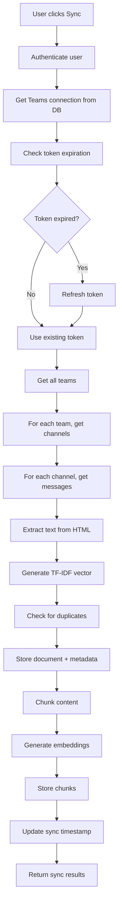

# Microsoft Teams Integration - Complete Implementation

## Overview

Microsoft Teams integration has been successfully implemented following the established OAuth → Sync → Store → Embed → Search pattern used by other integrations (Notion, Slack, Google Drive).

## 🎯 Multi-Client Teams Strategy

This integration is designed for **multi-client professionals** who manage multiple Microsoft Teams tenants:

### Use Case Scenarios
- **Agency PM**: Managing 8 client Teams workspaces
- **Freelancer**: Working with 12 different client Teams
- **Founder**: Coordinating across 5 project Teams

### Cross-Workspace Search
Users can search across ALL their connected Teams workspaces simultaneously:
- "Show me all discussions about 'pricing' across all my client Teams"
- "Find every mention of 'feature X' in any client's Teams channels"
- "What did Client A say about the deadline in their Teams?"

### Workspace Attribution
Each Teams message is tagged with:
- **Client/Workspace name** (from Teams tenant)
- **Team name** and **Channel name**
- **Original Teams URL** for easy navigation back to source

## ⚠️ Important License Requirements

**Microsoft Teams integration requires a valid Office 365 license with Teams access.** This integration will not work with:
- Personal Microsoft accounts (@gmail.com, @outlook.com)
- Accounts without Office 365 Business/Enterprise licenses
- Free Microsoft accounts

**Supported account types:**
- Microsoft 365 Business/Enterprise accounts
- Work or school accounts with Teams access
- Any account with a valid Office 365 license that includes Teams

## Architecture

### Permission Model
- **Application Permissions**: Uses `ChannelMessage.Read.All` for tenant-wide access
- **Admin Consent Required**: Global admin must grant consent once for entire tenant
- **Scope**: Channel messages only (no private chats in initial implementation)

### OAuth Flow
1. User clicks "Connect Teams" → redirects to Microsoft login
2. Admin consent screen (if first time) → user grants permissions
3. Authorization code exchanged for access + refresh tokens
4. Tokens stored in `user_connections` table with metadata
5. Redirect back to frontend with success confirmation

### Sync Process
1. **Authentication**: Retrieve Teams connection from database
2. **Token Management**: Check expiration, refresh if needed
3. **Data Retrieval**: 
   - Get all teams user is member of (`/me/joinedTeams`)
   - For each team, get channels (`/teams/{id}/channels`)
   - For each channel, get messages (`/teams/{id}/channels/{id}/messages`)
4. **Content Processing**:
   - Extract text from HTML message content
   - Strip HTML tags (Teams uses HTML vs Slack's markdown)
   - Filter system messages (only process `messageType === 'message'`)
5. **Storage**: Store documents with metadata (team, channel, sender, etc.)
6. **Embeddings**: Generate chunks and OpenAI embeddings for search
7. **Duplicate Detection**: TF-IDF similarity matching with other sources

## Implementation Details

### Backend Components

#### 1. OAuth Routes (`server/index.js`)
```javascript
// Teams OAuth callback
app.get('/api/auth/teams/callback', async (req, res) => {
  // Exchange code for tokens
  // Fetch user info from Graph API
  // Store connection in database
  // Redirect to frontend
});
```

#### 2. Sync Service (`server/services/teams-sync.js`)
- **TeamsSync Class**: Main sync logic with Graph API client
- **Token Refresh**: Automatic token renewal using refresh_token
- **Rate Limiting**: 1-second delays between requests, exponential backoff
- **Incremental Sync**: Only sync messages modified since last sync
- **Error Handling**: Comprehensive error handling with user-friendly messages

#### 3. API Endpoint (`POST /api/sync/teams`)
- Authenticates user via JWT
- Verifies Teams connection exists
- Calls sync service
- Returns sync statistics and results

### Frontend Components

#### 1. Teams Icon Component
Custom SVG icon matching Microsoft Teams branding:
```typescript
const TeamsIcon = ({ className = "" }: { className?: string }) => (
  <svg xmlns="http://www.w3.org/2000/svg" width="24" height="24" viewBox="0 0 24 24">
    {/* Teams icon paths */}
  </svg>
);
```

#### 2. Source Configuration
```typescript
{
  id: 'teams',
  name: 'Microsoft Teams',
  description: 'Search through Teams channel messages and conversations',
  icon: TeamsIcon,
  color: 'bg-[#5059C9]',
  available: true,
  permissions: [
    'Channel messages',
    'Team member names', 
    'Channel structure'
  ]
}
```

#### 3. OAuth Handler
```typescript
// Teams OAuth URL construction
const teamsAuthUrl = new URL(`https://login.microsoftonline.com/${tenantId}/oauth2/v2.0/authorize`);
teamsAuthUrl.searchParams.set('client_id', clientId);
teamsAuthUrl.searchParams.set('redirect_uri', `${apiUrl}/api/auth/teams/callback`);
teamsAuthUrl.searchParams.set('scope', 'https://graph.microsoft.com/.default offline_access');
```

#### 4. Permission Modal
Detailed permissions explanation for users:
- **Will Access**: Channel messages, team info, member names
- **Won't Access**: Cannot send messages, modify teams, access private chats

## Environment Configuration

### Required Environment Variables

#### Backend (`.env.local`)
```env
# Microsoft Teams OAuth Configuration
MICROSOFT_TENANT_ID=your-tenant-id-here
MICROSOFT_CLIENT_ID=your-application-client-id-here
MICROSOFT_CLIENT_SECRET=your-client-secret-value-here
MICROSOFT_REDIRECT_URI=https://localhost:3000/api/auth/teams/callback
```

#### Frontend (`.env.local`)
```env
VITE_MICROSOFT_CLIENT_ID=your-client-id-here
VITE_MICROSOFT_TENANT_ID=your-tenant-id-here
```

### Azure AD App Registration Setup

1. **Navigate to Azure Portal** → Microsoft Entra ID → App registrations
2. **Create new registration**:
   - Name: "Haven7 Knowledge Search"
   - Account types: "Accounts in this organizational directory only"
   - Redirect URI: `https://localhost:3000/api/auth/teams/callback`
3. **Note credentials**: Application (client) ID and Directory (tenant) ID
4. **Create client secret**: Certificates & secrets → New client secret (24 months max)
5. **Configure API permissions**:
   - Add `ChannelMessage.Read.All` (Application)
   - Add `Team.ReadBasic.All` (Application) 
   - Add `Channel.ReadBasic.All` (Application)
   - **CRITICAL**: Click "Grant admin consent for [Your Org]"

## Key Differences from Slack Integration

| Aspect | Slack | Teams |
|--------|-------|-------|
| **Permission Model** | Bot user with scopes | Application permissions (admin consent) |
| **Content Format** | Markdown | HTML (requires stripping) |
| **Token Expiration** | Never expires | Expires (needs refresh logic) |
| **Rate Limits** | Generous | Aggressive (requires delays) |
| **Message Types** | All messages | Filter system messages |
| **Admin Consent** | Not required | Required for tenant-wide access |

## Sync Process Flow



## Error Handling

### Common Errors & Solutions

| Error | Cause | Solution |
|-------|-------|----------|
| "Need admin approval" | Admin consent not granted | Grant consent in Azure Portal |
| 401 Unauthorized | Token expired | Implement refresh token logic |
| 429 Too Many Requests | Rate limit hit | Add delays, exponential backoff |
| Empty messages array | No team membership | Verify user is in teams |
| CORS errors | HTTPS certificate issue | Verify SSL certificates |

### Error Response Codes
- `TOKEN_EXPIRED`: Teams token expired, user needs to reconnect
- `NOT_CONNECTED`: Teams not connected for this user
- `QUOTA_EXCEEDED`: API quota exceeded, try again later
- `SYNC_FAILED`: General sync error

## Testing Checklist

### 1. Connection Test
- [ ] Click "Connect Teams" → redirects to Microsoft login
- [ ] Admin consent screen appears (if first time)
- [ ] Successful redirect back with `?connected=teams`
- [ ] `user_connections` table has new entry with `source_type='teams'`
- [ ] Access token and refresh token stored

### 2. Sync Test
- [ ] Click "Sync Documents" on Teams card
- [ ] Backend console shows: "Found X teams", "Processing team: [name]"
- [ ] Database queries return Teams documents:
  ```sql
  SELECT COUNT(*) FROM documents WHERE source_type = 'teams';
  SELECT COUNT(*) FROM document_chunks WHERE metadata->>'source_type' = 'teams';
  ```

### 3. Search Test
- [ ] Search for known Teams message content
- [ ] Results show Teams messages with:
  - Team name, channel name, sender name
  - Clickable URL (opens in Teams)
  - Correct snippet highlighting

### 4. Error Handling Tests
- [ ] Token expiration (simulate by invalidating token)
- [ ] Rate limiting (sync large workspace)
- [ ] Missing admin consent (revoke and try again)
- [ ] No accessible teams (test with restricted user)

### 5. Incremental Sync Test
- [ ] Initial sync → record document count
- [ ] Wait 5 minutes, add new Teams message
- [ ] Re-sync → verify only new message processed
- [ ] Check `last_synced_at` in `user_connections`

## Performance Considerations

### Rate Limiting
- **Graph API Limits**: 10,000 requests per 10 minutes per app
- **Implementation**: 1-second delays between message requests
- **Backoff Strategy**: Exponential backoff for 429 errors

## Troubleshooting

### Common Issues

#### 1. "Microsoft Teams requires a valid Office 365 license" Error
**Cause:** Using a personal Microsoft account without Teams license
**Solution:** Use a work/school account with Office 365 Business/Enterprise license

#### 2. 403 Forbidden Error
**Cause:** Insufficient permissions or license issues
**Solutions:**
- Ensure admin consent is granted for all required permissions
- Verify account has valid Office 365 license with Teams
- Check that user is member of Teams in the organization

#### 3. No Teams Found
**Cause:** User not member of any Teams or no Teams exist
**Solution:** Join Teams in your organization or create test Teams

#### 4. Empty Sync Results
**Cause:** No messages in accessible Teams/channels
**Solution:** Ensure Teams have messages and user has access to channels with messages
- **Respect Headers**: Honor `Retry-After` header from Microsoft

### Sync Limits (Configurable)
```env
MAX_TEAMS=10                    # Limit teams for testing
MAX_CHANNELS_PER_TEAM=20        # Limit channels per team
MAX_MESSAGES_PER_CHANNEL=50     # Limit messages per channel
MAX_CHUNKS_PER_DOCUMENT=10      # Limit chunks per document
```

### Memory Management
- Process teams sequentially (not parallel) to avoid memory issues
- Delete existing chunks before inserting new ones
- Use batch processing for embeddings (20 per batch)

## Security Considerations

### Token Security
- Access tokens stored encrypted in Supabase
- Refresh tokens used for automatic renewal
- Token expiration handled gracefully
- No token exposure in frontend logs

### Data Privacy
- Only channel messages synced (no private chats)
- User can disconnect anytime (immediate token revocation)
- No data shared with third parties
- TF-IDF vectors for duplicate detection only

### Admin Consent
- Required for tenant-wide access
- One-time approval by global admin
- Cannot be bypassed by individual users
- Provides enterprise-grade security

## Production Deployment

### Prerequisites
1. **Azure AD App Registration** with production redirect URI
2. **Admin Consent** granted for production tenant
3. **HTTPS Endpoint** for OAuth callbacks
4. **Environment Variables** configured for production

### Scaling Considerations
1. **Webhook Subscriptions**: Replace polling with change notifications
2. **Parallel Processing**: Process multiple teams simultaneously
3. **Database Optimization**: Index on `source_type` and `user_id`
4. **Caching**: Cache team/channel lists to reduce API calls

### Monitoring
- Sync success/failure rates
- Token refresh frequency
- API quota usage
- Error rates by error type

## Future Enhancements

### Phase 2 Features
- **Private Chats**: Add support for 1:1 and group chats
- **Meeting Transcripts**: Sync meeting recordings and transcripts
- **File Attachments**: Process files shared in Teams
- **Reactions & Replies**: Include message reactions and thread replies

### Advanced Features
- **Webhook Subscriptions**: Real-time sync via change notifications
- **Multi-tenant Support**: Support users from different Azure AD tenants
- **Advanced Filtering**: Filter by date range, message types, channels
- **Bulk Operations**: Bulk sync, bulk disconnect, bulk clear data

## Troubleshooting Guide

### Connection Issues
1. **"Need admin approval"**: Admin must grant consent in Azure Portal
2. **CORS errors**: Verify HTTPS certificates are installed
3. **Invalid redirect URI**: Check Azure app registration settings
4. **Token exchange failed**: Verify client secret is correct

### Sync Issues
1. **No messages found**: Check user is member of teams
2. **Rate limit errors**: Increase delays between requests
3. **Token expired**: Implement refresh token logic
4. **Empty results**: Check date filters and permissions

### Search Issues
1. **No search results**: Verify embeddings were generated
2. **Incorrect snippets**: Check chunking logic
3. **Missing metadata**: Verify Teams message structure
4. **URL not working**: Check `webUrl` field in message object

## Support & Maintenance

### Regular Maintenance
- Monitor token refresh success rates
- Check for new Microsoft Graph API changes
- Update rate limiting based on usage patterns
- Review and update sync limits as needed

### Support Contacts
- **Azure AD Issues**: Microsoft support or tenant admin
- **Graph API Issues**: Microsoft Graph documentation
- **Application Issues**: Haven7 support team

## Conclusion

Microsoft Teams integration provides enterprise-grade document search capabilities with:
- **Secure OAuth flow** with admin consent
- **Comprehensive sync** of channel messages
- **Intelligent duplicate detection** across sources
- **Robust error handling** and user feedback
- **Scalable architecture** ready for production

The implementation follows established patterns from other integrations while addressing Teams-specific requirements like HTML content processing, token refresh, and admin consent workflows.
